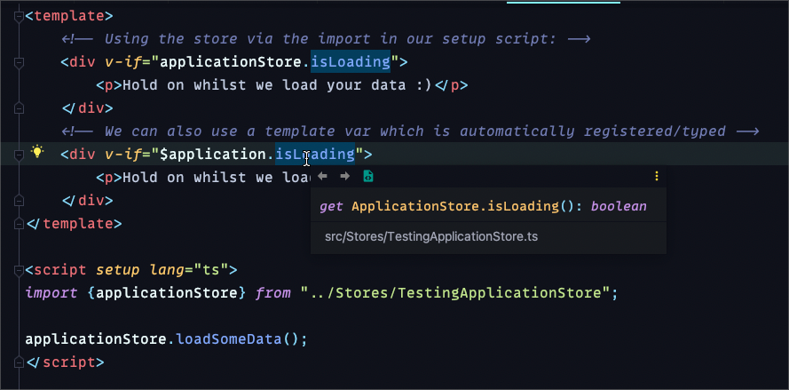
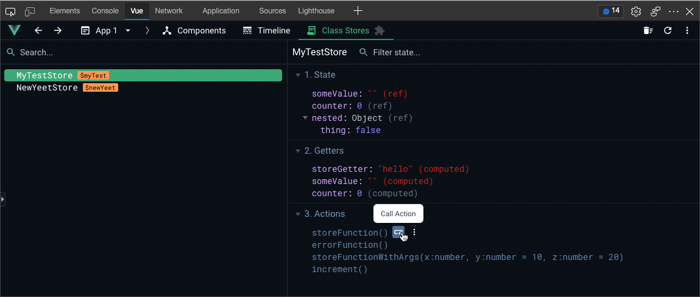

<p align="center">
A vite/vue package for elegant class based stores
</p>

### Getting Started

Install the npm package:

```shell
npm install @idevelopthings/vue-class-stores
yarn add @idevelopthings/vue-class-stores
```

#### Vite plugin:

```js
import vue                 from '@vitejs/plugin-vue';
import {ClassStoresPlugin} from "@idevelopthings/vue-class-stores/vite";

export default defineConfig({
	plugins : [
		ClassStoresPlugin({
			// The src path where your stores will be located
			storesPath : 'src/Stores',
			// The name of the generated typescript declaration file
			// stores.d.ts is the default
			storesFileName : 'stores.d.ts',
		}),
		vue(),
    ]
});
```

#### Vue Plugin:

Register the plugin with vue in your main init script

```typescript
import {createApp} from 'vue';
import {StoreManager} from "@idevelopthings/vue-class-stores/vue";
import App from './App.vue';

const app = createApp(App);
// Unfortunately, at the moment, you need to provide this glob import 
app.use(StoreManager, import.meta.glob('./Stores/*', {eager : true})); 
app.mount('#app');
```

And that's all, now you can get to building!

#### Creating your first store

Let's create a store which will be used globally, for this example, it will hold some application state.
Imagine our application needs to load some data and display an overlay of some kind whilst this is taking place.

Head over to src/Stores and create a new file

**Note:** This file has to end in "Store.ts" or "store.ts"

```typescript
import {Store} from "@idevelopthings/vue-class-stores";

interface IApplicationStore {
	loading: boolean;
}

class ApplicationStore extends Store<ApplicationStore, IApplicationStore>() {

	get state(): IApplicationStore {
		return {
			loading : false
		};
	}

	get isLoading() {
		return this.$loading === true;
	}

	setLoading(loading: boolean) {
		this.$loading = loading;
	}

	// Just a dummy, imagine we have an api request here ^^
	async loadSomeData() {
		// Set our loading state here.
		this.setLoading(true);
		return new Promise((resolve) => setTimeout(() => {
			this.setLoading(false);
			resolve(true);
		}, 1000));
	}

}

export const applicationStore = new ApplicationStore();
```

Let's unpack this a little:

```typescript 
// ApplicationStore - we need to include the type of our store as a type param
// IApplicationStore - the type for the `get state()` (our actual state structure)
extends Store<ApplicationStore, IApplicationStore>() // <- note that we make a function call!
```

get state():

``` 
get state(): IApplicationStore {
	return {
		loading : false
	};
}
```

This holds our "initial state", and gives us a reference/types for our state data.
Once our store is built behind the scenes, this will be replaced in the background

```
get isLoading() {
	// We can use this.state.loading also!
	return this.$loading === true;
}

setLoading(loading: boolean) {
	this.$loading = loading;
}
```

All methods, getters and setters are available publicly and in vue templates.

With vue-class-stores, there's no need to create separate actions/getters/mutations or deal with committing etc, used with stores like VueX

A regular JS getter is a used, methods are actions and you can mutate state how ever you wish.

The main goal is to keep things together, available globally(at our discretion)

```typescript
export const applicationStore = new ApplicationStore();
```

We export our store as a const, we only want one instance of this store, this is also how we'll use our store from other classes/stores etc.

#### Vue SFC:

```vue
<template>
	<!-- Using the store via the import in our setup script: -->
	<div v-if="applicationStore.isLoading">
		<p>Hold on whilst we load your data :)</p>
	</div>
	<!-- We can also use a template var which is automatically registered/typed -->
	<div v-if="$application.isLoading">
		<p>Hold on whilst we load your data :)</p>
	</div>
</template>

<script setup lang="ts">
import {applicationStore} from "../Stores/TestingApplicationStore";

applicationStore.loadSomeData();
</script>
```



### Vue Dev Tools Plugin
The package will automatically register the vue devtools plugin for you
This will allow you to inspect your state and trigger your, actions for testing purposes(although you cannot pass parameters yet :())

You can also edit your state from the plugin also :)


